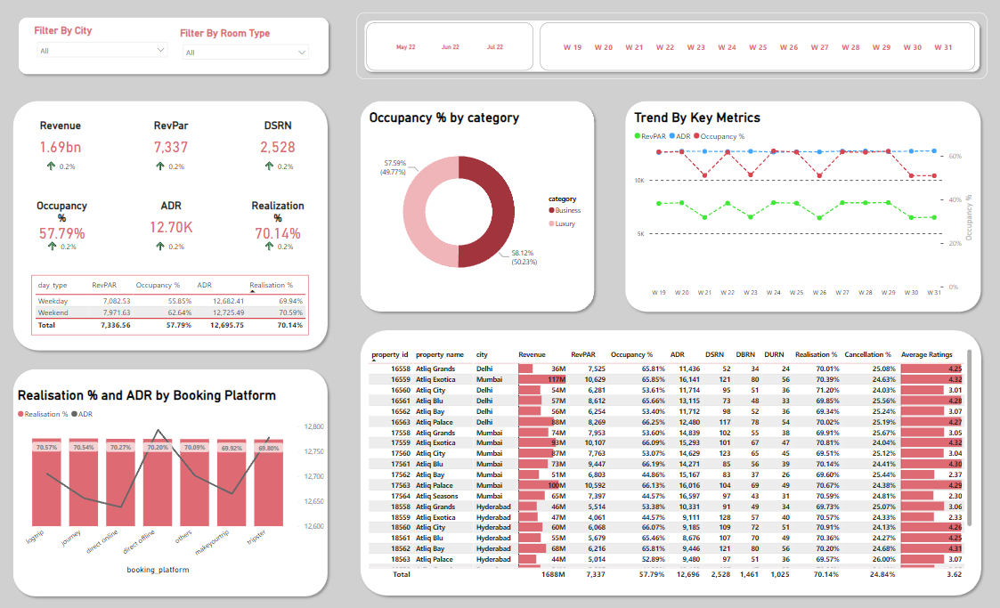

# Hospitality Domain Dashboard

## Description

This repository houses a comprehensive dashboard tailored for the hospitality industry. The dashboard provides key performance indicators (KPIs), data visualizations, and analytics that offer valuable insights to hotel managers, owners, and other stakeholders. It aims to optimize business operations, enhance guest experience, and improve decision-making in the hospitality domain.

## Features and Functionality

- **Occupancy and Revenue Analysis:** Monitor room occupancy rates and revenue trends over time to optimize pricing and promotions.
- **Guest Feedback Analysis:** Analyze guest feedback from various sources to identify areas for improvement and enhance guest satisfaction.
- **Employee Performance:** Evaluate staff performance metrics to enhance workforce management and training initiatives.
- **Revenue Centers Breakdown:** Understand revenue distribution across various services like restaurants, spas, events, and more.
- **Reservation and Booking Analysis:** Track booking patterns and reservation trends to manage capacity and resources effectively.
- **Customizable Dashboard:** The dashboard is highly customizable to cater to the specific needs of each hospitality business.

## Data Source and Sample Data

- Data Source: The data used in this dashboard is purely fictional and is for demonstration purposes only. It does not represent real production data from any hotel or hospitality business.
- Sample Data: A subset of anonymized sample data is provided in this repository to showcase the capabilities of the dashboard. You can find the data in the `Resources` folder along with the data schema in `meta_data_hospitality.txt`.

## Installation and Setup

1. Clone this repository to your local machine: git clone https://github.com/mukeshsundar23/Hospitality-Dashboard-Project.git

2. Ensure you have the required software installed to view the dashboard. For example, you might need Power BI Desktop or another BI tool compatible with the dashboard format.

3. Open the BI tool and load the main dashboard file `Dashboard.pbix` from the cloned repository directory.

4. Once the dashboard is loaded, you can explore the hospitality data using the interactive visualizations.

## Screenshots

## Contact

If you have any questions or need assistance, feel free to contact me at [mukeshsundar2362004@gmail.com](mailto:mukeshsundar2362004@gmail.com).

